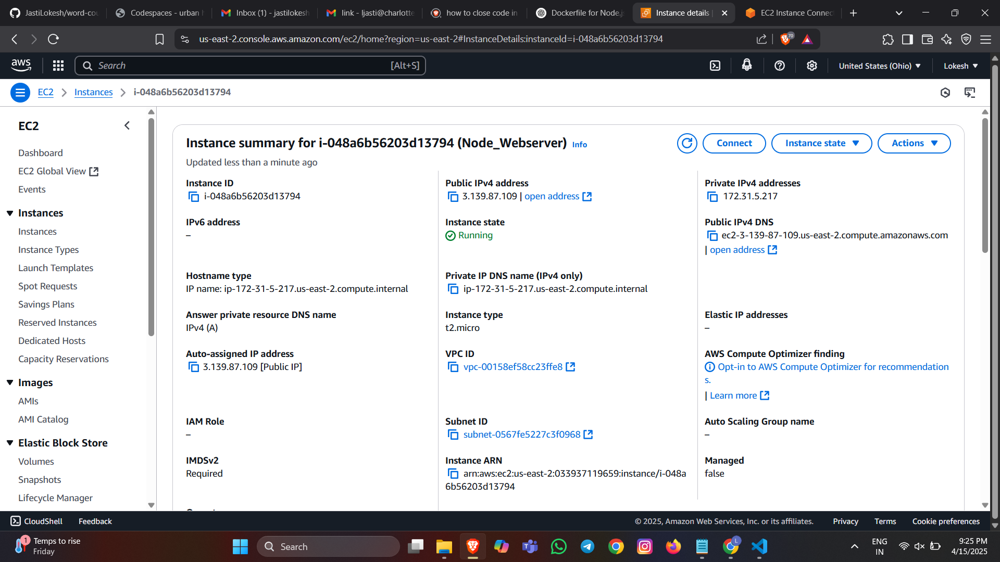

### **Word Count on AWS with PySpark, Node.js Deployment, and ETL Pipeline**

---

## **Project 1: Word Count on AWS EC2/LightSail using PySpark**

### **Objective**  
Set up PySpark on an AWS instance to count words in a text file stored in an S3 bucket.

---

### **1. Prerequisites**  
Ensure you have:  
- An AWS account with access to EC2/LightSail.  
- An S3 bucket containing your text file.  
- SSH access to the instance.  

---

### **2. Set Up EC2/LightSail Instance**  
1. Launch an Amazon Linux 2 instance and connect via SSH:  
   ```bash
   ssh -i "word_count.pem" ec2-user@i-048a6b56203d13794
   ```

2. Install **Java 11**:  
   ```bash
   sudo yum install java-11 -y
   export JAVA_HOME=$(dirname $(dirname $(readlink -f $(which java))))
   java --version
   ```

3. Increase `/tmp` size to prevent Spark errors:  
   ```bash
   sudo mount -o remount,size=2G /tmp
   ```

4. Install Python and PySpark:  
   ```bash
   sudo yum install python3-pip -y
   pip install pyspark
   spark-submit --version
   ```

---

### **3. Word Count Script**  
Create `word_count.py`:

```python
from pyspark.sql import SparkSession

# AWS Credentials
AWS_ACCESS_KEY_ID = 'TEMP'
AWS_SECRET_ACCESS_KEY = 'TEMP'

# S3 paths
S3_INPUT = 's3a://lokesh-word-count/input.txt'
S3_OUTPUT = 's3a://lokesh-word-count/output_folder/'

# Spark Session
spark = SparkSession.builder \
    .appName("WordCount") \
    .config("spark.jars.packages", "org.apache.hadoop:hadoop-aws:3.3.1,com.amazonaws:aws-java-sdk-bundle:1.11.901") \
    .getOrCreate()

# Hadoop S3 Configuration
hadoop_conf = spark.sparkContext._jsc.hadoopConfiguration()
hadoop_conf.set("fs.s3a.access.key", AWS_ACCESS_KEY_ID)
hadoop_conf.set("fs.s3a.secret.key", AWS_SECRET_ACCESS_KEY)

# Word Count Logic
text_file = spark.sparkContext.textFile(S3_INPUT)
counts = text_file.flatMap(lambda line: line.split()) \
                  .map(lambda word: (word, 1)) \
                  .reduceByKey(lambda a, b: a + b)
counts.saveAsTextFile(S3_OUTPUT)
spark.stop()
```

Run with:  
```bash
spark-submit word_count.py
```
## Output:



---

## **Project 2: Deploy a Node.js Web Server with Docker**

### **Objective**  
Deploy a simple Node.js server in a Docker container, push the image to Docker Hub, and run it on an EC2 instance.

---

### **1. Node.js Server**  
1. Create a directory and initialize a project:  
   ```bash
   mkdir node-webserver && cd node-webserver
   npm init -y
   npm install express
   ```

2. Create `server.js`:  
   ```javascript
   const express = require('express');
   const app = express();
   const port = 3000;

   app.get('/', (req, res) => {
       res.send('Hello, World! Running in Docker.');
   });

   app.listen(port, () => console.log(`Server running at http://localhost:${port}`));
   ```

---

### **2. Dockerize the Application**  
1. Create a `Dockerfile`:  
   ```dockerfile
   FROM node:20
   WORKDIR /app
   COPY package*.json ./
   RUN npm install
   COPY . .
   EXPOSE 3000
   CMD ["node", "server.js"]
   ```

2. Build and push the image to Docker Hub:  
   ```bash
   docker build -t lokeshjasti25/webserver:latest .
   docker push lokeshjasti25/webserver:latest
   ```

---

### **3. Deploy on EC2**  
1. Install Docker:  
   ```bash
   sudo yum update -y
   sudo yum install docker -y
   sudo service docker start
   sudo usermod -aG docker ec2-user
   ```

2. Run the container:  
   ```bash
   docker pull lokeshjasti25/webserver:latest
   docker run -d -p 80:3000 lokeshjasti25/webserver:latest
   ```

Access at: `http://3.139.87.109/`.


## Output:


---

## **Project 3: ETL Pipeline with AWS Lambda**

### **Objective**  
Set up a serverless ETL pipeline to process files uploaded to an S3 bucket.

---

### **1. Workflow**  
1. **Trigger**: New file in the source bucket invokes the Lambda function.  
2. **Process**: Lambda cleans the data and filters rows with missing values.  
3. **Output**: Cleaned data is saved to the destination bucket.  

---

### **2. Setup**  

#### **AWS Resources**  
1. Create S3 buckets for source (raw data) and destination (processed data).  
2. Set up an IAM role with permissions for S3 and CloudWatch Logs.  

#### **Lambda Function**  
1. Create `etl_lambda.py`:  

```python
import boto3
import csv
import io
import logging

# Set up the logger
logger = logging.getLogger()
logger.setLevel(logging.INFO)

def lambda_handler(event, context):
    # Log the event details to track the input event
    logger.info("Received event: %s", event)
    
    # Extract bucket and file details from the event
    try:
        source_bucket = event['Records'][0]['s3']['bucket']['name']
        object_key = event['Records'][0]['s3']['object']['key']
        destination_bucket = 'etl-cleaned-data-1'  # Replace with your destination bucket name
        
        logger.info("Source bucket: %s", source_bucket)
        logger.info("Object key: %s", object_key)
        logger.info("Destination bucket: %s", destination_bucket)
    except KeyError as e:
        logger.error("Error extracting event data: %s", e)
        raise ValueError(f"Missing expected field in event: {e}")

    s3 = boto3.client('s3')

    try:
        # Extract: Read the file from S3
        logger.info("Fetching file from S3...")
        response = s3.get_object(Bucket=source_bucket, Key=object_key)
        raw_data = response['Body'].read().decode('utf-8').splitlines()
        logger.info("File fetched successfully. Size: %d bytes", len(raw_data))
    except Exception as e:
        logger.error("Error fetching file from S3: %s", e)
        raise

    # Transform: Clean and process data
    cleaned_data = []
    try:
        logger.info("Cleaning data...")
        reader = csv.reader(raw_data)
        header = next(reader)  # Read the header
        cleaned_data.append(header)  # Keep the header
        logger.info("Header: %s", header)

        for row in reader:
            # Log the row before processing for visibility
            logger.debug("Processing row: %s", row)

            # Filter out rows with missing values (e.g., null Age)
            if row[2] != '':
                cleaned_data.append(row)
            else:
                logger.info("Skipping row due to missing data: %s", row)
        
        logger.info("Data cleaning complete. Processed %d rows.", len(cleaned_data) - 1)
    except Exception as e:
        logger.error("Error processing data: %s", e)
        raise

    # Load: Write the cleaned data back to S3
    try:
        logger.info("Writing cleaned data to S3...")
        output_buffer = io.StringIO()
        writer = csv.writer(output_buffer)
        writer.writerows(cleaned_data)
        
        s3.put_object(
            Bucket=destination_bucket,
            Key=f"cleaned_{object_key}",
            Body=output_buffer.getvalue()
        )
        
        logger.info("File saved to S3 as cleaned_%s", object_key)
    except Exception as e:
        logger.error("Error writing to S3: %s", e)
        raise

    return {
        'statusCode': 200,
        'body': f"File processed and saved to {destination_bucket}/cleaned_{object_key}"
    }
```

---

### **3. Add Trigger and Test**  
1. Add an **S3 trigger** for the source bucket with "ObjectCreated" events.  
2. Upload a file to the source bucket and verify logs in **CloudWatch**.

---

### **Best Practices for All Projects**  
1. Use environment variables for sensitive data like API keys.  
2. Tag Docker images with semantic versions for easy updates.  
3. Monitor logs for troubleshooting.  
4. Follow AWS best practices for security and cost optimization.  
